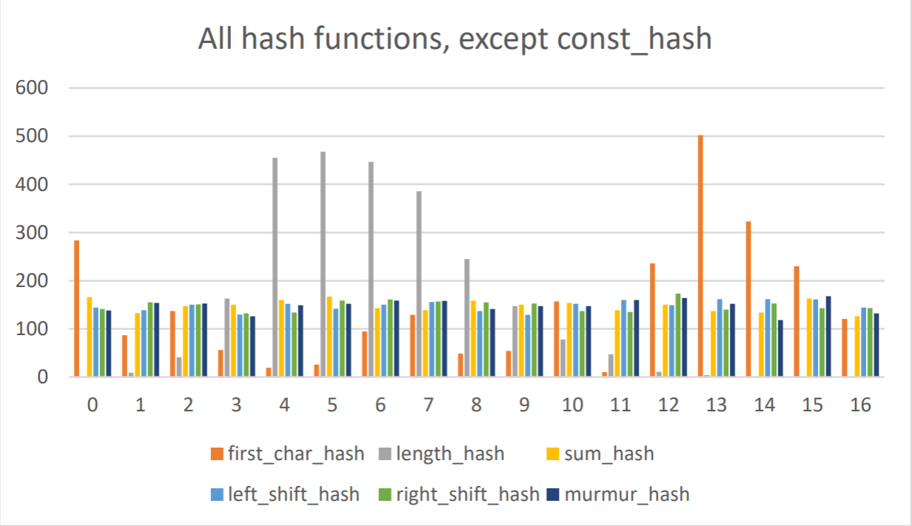
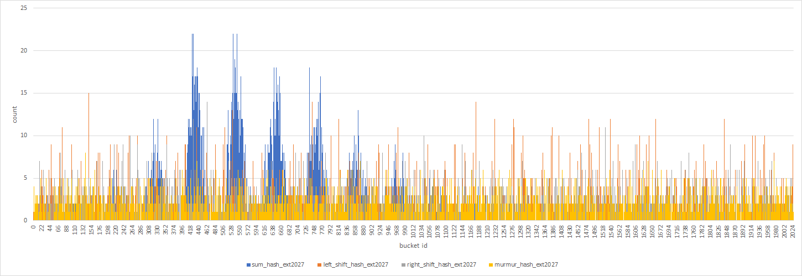
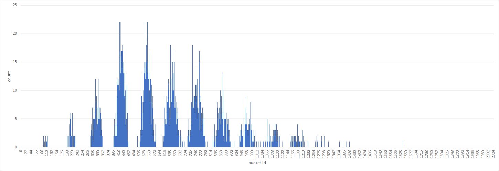
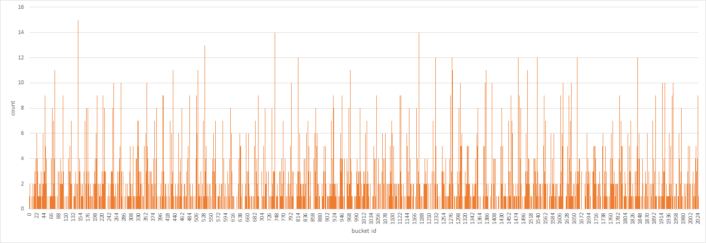
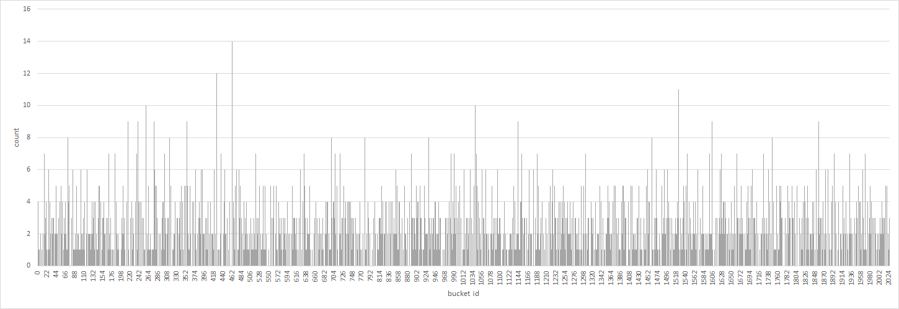
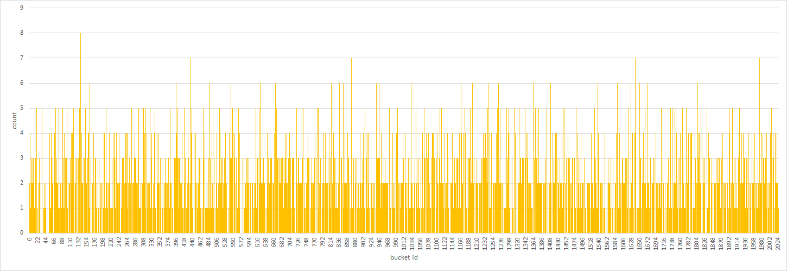

# Исследование распределений хеш-функций в задаче хранения слов художественного текста
## Введение
Рассмотрим следующую задачу:

*"Дан художественный текст на английском языке. Требуется составить множество слов текста, то есть структуру, хранящую все его слова и позволяющую как можно быстрее определять принадлежность некоторого слова к нему."*

Задача может быть решена с использованием хеш-таблицы c закрытой адресацией (описание алгоритма на [AlgoList](https://www.algolist.net/Data_structures/Hash_table)).

Алгоритм основан на разбиении входного множества ключей на подмножества, в которых у каждого ключа 

Целью данной работы было получение распределений хешей различных хеш-функций, используя в качестве ключей слова произведения Вильяма Шекспира "The Comedy of Errors" (текст приведён в файле [assets/comedy_of_errors.txt](./assets/comedy_of_errors.txt)).

Исследуемые хеш-функции:
 - `constant_hash`: сопоставляет любому ключу хеш 1, $h(x)=1$,
 - `first_char_hash`: сопоставляет каждому ключу хеш его первого байта, $h(x)=x_0$,
 - `length_hash`: сопоставляет каждому ключу его длину как нуль-терминированного слова, $h(x)=\text{len}(x)$,
 - `sum_hash`: сопоставляет каждому ключу сумму значений его байт, $h(x)=\sum_{i}x_i$,
 - `left_shift_hash`: сопоставляет каждому ключу такой последовательный XOR его байт, что после каждой операции побитового исключения выполняется циклический сдвиг хеша на 1 бит влево, $\text{len}(x)=0 \Rightarrow h(x)=0$, $\text{len}(x)>0 \Rightarrow h(x)=\text{rol}(h(x|_{[0, \dots ,\text{len}(x)-1)}))\otimes x_{\text{len}(x)-1}$,
 - `right_shift_hash`: аналогично `left_shift_hash`, но сдвиг происходит вправо, $\text{len}(x)=0 \Rightarrow h(x)=0$, $\text{len}(x)>0 \Rightarrow h(x)=\text{ror}(h(x|_{[0, .. ,\text{len}(x)-1)}))\otimes x_{\text{len}(x)-1}$,
 - `murmur_hash`: [MurmurHash64](https://en.wikipedia.org/wiki/MurmurHash).

Использованные обозначения:
 - $h$ - хеш-функция,
 - $x$ - ключ (строка символов $x_1,x_2,\dots,x_{\text{len}(x)-1}$),
 - $x_i$ - $i$-й символ строки $x$ (в нумерации с 0)
 - $\text{len}(x)$ - длина строки $x$,
 - $x|_{[0, \dots ,\text{len}(x)-1)}$ - строка $x$ кроме последнего символа,
 - $\text{rol}(t)$ - циклический побитовый сдвиг числа $t$ влево,
 - $\text{ror}(t)$ - циклический побитовый сдвиг числа $t$ вправо,

Реализации хеш-функций приведены в файле [src/hash/hash_functions.cpp](src/hash/hash_functions.cpp).

## Методы
Была составлена программа, реализующая хеш-таблицу на 17 списков. Данной программе на выход передавался массив слов произведения (без учёта регистра). Массив слов мог включать повторения.

После распределения слов по спискам хеш-таблицы в соответствии с хешами, выданными тестируемой хеш-функцией, программа измеряла длины получившихся списков и записывала измерения в файл в виде таблицы в формате `csv`.

Каждое уникальное слово записывалось в хеш-таблицу равно один раз вне зависимости от количества его повторений в тексте.

## Результаты
Результаты измерений были сохранены и обработаны в файле [results/combined_proc.xlsx](results/combined_proc.xlsx). Таблица результатов эксперимента расположена на странице *Results*, гистограммы распределений - на странице *Plots*, а таблица со статистическими характеристиками распределений - на странице *Processing*.

Полученные распределения ключей по спискам представлены в гистограммах (фигуры 1, 2).

|  |
| --- |
| *Фигура 1. Гистограмма распределений, даваемых всеми тестируемыми функциями. Обозначения: count - количество слов в списке, bucket id - индекс списка.* |

|  |
| --- |
| *Фигура 2. Гистограмма распределений, даваемых всеми неконстантными тестируемыми хеш-функциями. Обозначения: count - количество слов в списке, bucket id - индекс списка.* |

Статистические характеристики распределений представлены в таблице 1.

*Таблица 1. Максимумы и среднеквадратические отклонения распределений тестируемых хеш-функций на хеш-таблицу с 17 списками. Обозначения: max count - максимальная длина списка в таблице, deviation - среднеквадратическое отклонение длин списков.*
|           | constant_hash | first_char_hash | length_hash | sum_hash | left_shift_hash | right_shift_hash | murmur_hash |
| --------- | ------------- | --------------- | ----------- | -------- | --------------- | ---------------- | ----------- |
| max count | 1784          | 393             | 420         | 161      | 166             | 155              | 163         |
| deviation | 432.68        | 104.52          | 155.83      | 11.82    | 9.36            | 9.20             | 12.37       |

`sum_hash`, `left_shift_hash`, `right_shift_hash` и `murmur_hash` были перетестированы на хеш-таблице с 2027 списками. Результаты тестирования представлены на фигурах 3-7 и в таблице 2.

|  |
| --- |
| *Фигура 3. Гистограммы распределений, даваемых `sum_hash`, `left_shift_hash`, `right_shift_hash` и `murmur_hash` в хеш-таблице на 2027 списков. Обозначения: count - количество слов в списке, bucket id - индекс списка. Хеш-функций обозначены своими названиями с суффиксом `_ext2027`* |

|  |
| --- |
| *Фигура 4. Гистограмма распределения, даваемого `sum_hash` в хеш-таблице на 2027 списков. Как можно заметить образуются отчётливые "скопления" хешей. Обозначения: count - количество слов в списке, bucket id - индекс списка.* |

|  |
| --- |
| *Фигура 5. Гистограмма распределения, даваемого `left_shift_hash` в хеш-таблице на 2027 списков. Визуально распределение более равномерное, чем у `sum_hash`, но ещё возникают пики до 15 слов в списке. Обозначения: count - количество слов в списке, bucket id - индекс списка.* |

|  |
| --- |
| *Фигура 6. Гистограмма распределения, даваемого `right_shift_hash` в хеш-таблице на 2027 списков. Визуально распределение более равномерное, чем у `sum_hash`, но ещё возникают пики до 14 слов в списке. Обозначения: count - количество слов в списке, bucket id - индекс списка.* |

|  |
| --- |
| *Фигура 7. Гистограмма распределения, даваемого `murmur_hash` в хеш-таблице на 2027 списков. Визуально распределение более равномерное, чем у `sum_hash`. Возникают пики до 8 слов в списке. Обозначения: count - количество слов в списке, bucket id - индекс списка.* |

*Таблица 2. Максимумы и среднеквадратические отклонения распределений `sum_hash`, `left_shift_hash`, `right_shift_hash` и `murmur_hash` в таблице с 2027 списками. Обозначения: max count - максимальная длина списка в таблице, deviation - среднеквадратическое отклонение длин списков. К названиям хеш-функция добавлен суффикс `_ext2027`.*
|           | sum_hash_ext2027 | left_shift_hash_ext2027 | right_shift_hash_ext2027 | murmur_hash_ext2027 |
| --------- | ---------------- | ----------------------- | ------------------------ | ------------------- |
| max count | 22               | 15                      | 14                       | 8                   |
| deviation | 3.34             | 2.26                    | 1.85                     | 1.51                |

## Выводы и обсуждение
Как показывают экспериментальные данные, распределения с наименьшим отклонением на таблице с 17 списками дают `sum_hash`, `left_shift_hash`, `right_shift_hash` и `murmur_hash`.

На таблице с 2027 списками распределения с наименьшими среднеквадратическими отклонениями возникают у `right_shift_hash` и `murmur_hash`.

`const_hash` не может дать равномерное распределение в силу своего определения (использование его в хеш-таблице равносильно превращению хеш-таблицы в массив).

Распределение, даваемое `first_char_hash` на данном наборе ключей, соответствует частотам использования букв латинского алфавита в началах английский слов. Как можно заметить, оно далеко от равномерного.

`length_hash` даёт распределение, визуально похожее на нормальное. Оно соответствует распределению длин слов в английском языке. Как и в случае с `first_char_hash` данное распределение не является оптимальным в условиях рассматриваемой задачи.

`sum_hash`, `left_shift_hash`, `right_shift_hash` и `murmur_hash` все показывают хорошие результаты в хеш-таблице с 17 списками.

`sum_hash` "ломается" на таблице с 2027 списками в силу своего медленного роста при возрастании ключа. Каждый значимый байт ключа мог увеличить хеш не более чем на 255.

`left_shift_hash` мог дать результат с бОльшим максимумом и среднеквадратическим отклонением, чем `right_shift_hash` в силу меньшего возрастания хеша с ростом ключа по сравнению с `right_shift_hash` при малых значениях ключа (т.е. в случае однобуквенных ключей, которые в использованном тексте встречаются довольно часто). Данная разница могла уменьшить количество коллизий среди ключей малой длинны, что позволило `left_shift_hash` дать более равномерное распределение.

`left_shift_hash`, `right_shift_hash` и `murmur_hash` дают хорошие результаты в хеш-таблицах на 17 и 2027 списков, но распределение, даваемое `murmur_hash` даёт меньшую максимальную длину списка (8 в сравнении с 14 и 15) с меньшим среднеквадратическим отклонением.

Это говорит о том, что `left_shift_hash`, `right_shift_hash` и `murmur_hash` можно применять в хеш-таблицах для оптимизации распределений ключей по спискам.
