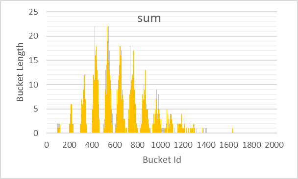
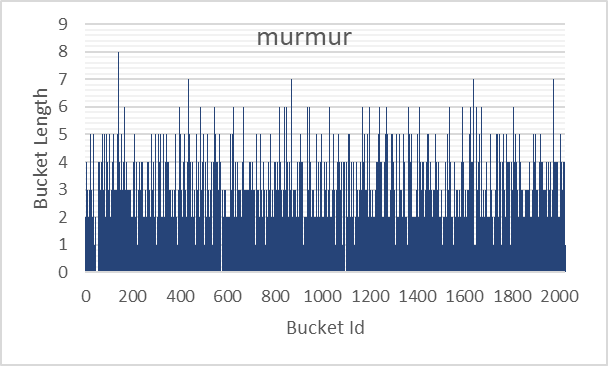
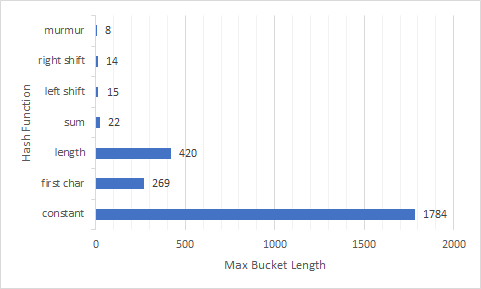

# Исследование распределений хеш-функций в задаче хранения слов художественного текста
## Введение
Рассмотрим следующую задачу:

*"Дан художественный текст на английском языке. Требуется составить множество слов текста, то есть структуру, хранящую все его слова и позволяющую как можно быстрее определять принадлежность некоторого слова к нему."*

Задача может быть решена с использованием хеш-таблицы c закрытой адресацией (см. описание алгоритма на сайте [AlgoList](https://www.algolist.net/Data_structures/Hash_table)).

Введём следующие определения:
 - **ключ** (**элемент**) - идентификатор элемента, хранящегося в структуре. В случае рассматриваемой задачи это слово из текста.
 - **хеш-функция** - функция, сопоставляющая ключам некоторые натуральные числа. Числа, сопоставляемые одинаковым ключам должны быть равны.
 - **хеш** - значение хеш-функции.
 - **список** (**bucket**) - множество элементов, в которое можно добавлять ключи и проверять, находятся ли они в нём. Соответствует структуре данных "связный список".
 - **хеш-таблица** (**таблица**) - множество списков, в каждом из которых всем ключам соответствуют одинаковые (по модулю количества списков в таблице) хеши.

**Проверка принадлежности** ключей к хеш-таблице происходит по следующему алгоритму:
 1. Пусть требуется проверить ключ $x$ на принадлежность к таблице. Посчитаем хеш элемента $h(x)$, где $h$ - хеш-функция.
 2. Рассмотрим $h(x) \text{mod} N$ - й список таблицы, где $N$ - количество списков в таблице. Если $x$ принадлежит списку, то $x$ принадлежит таблице. Иначе $x$ не принадлежит таблице.

|  |
| --- |
| *Рисунок 1. Иллюстрация к проверке принадлежности ключа к таблице. Зелёными ячейками обозначены индексы списков внутри таблицы. Синими клетками обозначены элементы самих списков. Символом '%' обозначено взятие числа по модулю. Остальные обозначения совпадают с обозначениями, введёнными в описании алгоритма.* |

**Добавление** ключа в таблицу происходит по следующему алгоритму:
 1. Если ключ $x$ уже принадлежит таблице, ничего не делать.
 2. Иначе добавить $x$ в $h(x) \text{mod} N$ - й список таблицы, где $N$ - количество списков в таблице, $h$ - хеш-функция.

|  |
| --- |
| *Рисунок 2. Иллюстрация к добавлению ключа к таблице. Обозначения аналогичны вводимым в рисунке 1.* |

Из алгоритма распределения ключей по спискам следует, что распределение зависит от выбора хеш-функции, используемой для подсчёта хешей элементов. К примеру, хеш-функция, возвращающая на все ключи число 1 (тождественно равная 1) даст распределение, отличное от того, что даёт хеш-функция, тождественно равная числу 2.

Целью данной работы было исследование распределений, даваемые различными хеш-функциям на массиве ключей, взятых из литературного текста.

Исследуемые хеш-функции:
 - `constant_hash`: сопоставляет любому ключу хеш 1, $h(x)=1$,
 - `first_char_hash`: сопоставляет каждому ключу хеш его первого байта, $h(x)=x_0$,
 - `length_hash`: сопоставляет каждому ключу его длину как нуль-терминированного слова, $h(x)=\text{len}(x)$,
 - `sum_hash`: сопоставляет каждому ключу сумму значений его байт, $h(x)=\sum_{i}x_i$,
 - `left_shift_hash`: сопоставляет каждому ключу такой последовательный XOR его байт, что после каждой операции побитового исключения выполняется циклический сдвиг хеша на 1 бит влево,
  
  $\text{len}(x)=0 \Rightarrow h(x)=0$
  
  $\text{len}(x)>0 \Rightarrow h(x)=\text{rol}(h(x_{[0, \dots ,\text{len}(x)-1)}))\otimes x_{\text{len}(x)-1}$,
 - `right_shift_hash`: аналогично `left_shift_hash`, но сдвиг происходит вправо,
 
  $\text{len}(x)=0 \Rightarrow h(x)=0$
  
  $\text{len}(x)>0 \Rightarrow h(x)=\text{ror}(h(x_{[0, .. ,\text{len}(x)-1)}))\otimes x_{\text{len}(x)-1}$,
 - `murmur_hash`: функция хеширования MurmurHash64

Использованные обозначения:
 - $h$ - хеш-функция,
 - $x$ - ключ (строка символов $x_1,x_2,\dots,x_{\text{len}(x)-1}$),
 - $x_i$ - $i$-й символ строки $x$ (в нумерации с 0)
 - $\text{len}(x)$ - длина строки $x$,
 - $x_{[0, \dots ,\text{len}(x)-1)}$ - строка $x$ кроме последнего символа,
 - $\text{rol}(t)$ - циклический побитовый сдвиг числа $t$ влево,
 - $\text{ror}(t)$ - циклический побитовый сдвиг числа $t$ вправо,
 - $\otimes$ - операция побитового исключающего "или".

Реализации хеш-функций приведены в файле [src/hash/hash_functions.cpp](src/hash/hash_functions.cpp) на странице `Processing`.

## Методы
Была составлена программа, реализующая хеш-таблицу на 2027 списков. Данной программе на вход передавался массив слов произведения Вильяма Шекспира ["The Comedy of Errors"](./assets/comedy_of_errors.txt) в кодировке utf-8 (без учёта регистра). Массив слов мог включать повторы.

После распределения слов по спискам хеш-таблицы в соответствии с хешами, выданными тестируемой хеш-функцией, программа измеряла длины получившихся списков и записывала измерения в файл в виде таблицы в формате `csv`.

## Результаты
Результаты измерений представлены на рисунках 3 - 8.

|  |  |
| --- | --- |
| *Рисунок 1а. Гистограмма распределения, даваемого `const_hash`.* | *Рисунок 1б. Участок гистограммы распределения, даваемого `const_hash`.* |

|  |  |
| --- | --- |
| *Рисунок 2а. Гистограмма распределения, даваемого `first_char_hash`.* | *Рисунок 2б. Участок гистограммы распределения, даваемого `first_char_hash`.* |

|  |  |
| --- | --- |
| *Рисунок 3а. Гистограмма распределения, даваемого `length_hash`.* | *Рисунок 3б. Гистограмма распределения, даваемого `length_hash`.* |

|  |
| --- |
| *Рисунок 4. Гистограмма распределения, даваемого `sum_hash`.* |

|  |
| --- |
| *Рисунок 5. Гистограмма распределения, даваемого `left_shift_hash`.* |

|  |
| --- |
| *Рисунок 6. Гистограмма распределения, даваемого `right_shift_hash`.* |

|  |
| --- |
| *Рисунок 7. Гистограмма распределения, даваемого `murmur_hash`.* |

|  |  |
| --- | --- |
| *Рисунок 8а. Сравнительная гистограмма среднеквадратических отклонений длин списков от всех исследованных хеш-функций.* | *Рисунок 8б. Сравнительная гистограмма максимумов длин списков от всех исследованных хеш-функций.* |

## Выводы и обсуждение
Как можно заметить, распределения, даваемые `sum_hash`, `left_shift_hash`, `right_shift_hash` и `murmur_hash` обладают наименьшими максимальными длинами списков и стандартными отклонениями. Среди них функцией, дающей наименьшее по максимальной длине и стандартному отклонению распределение является `murmur_hash`.

`const_hash` по определению определила все ключи в один список, что увеличило оба измеряемых параметра его распределения.

Значение `first_char_hash` не могла превышать 255 по определению, так как все ключи были в кодировке utf-8, и, следовательно, код первой буквы слова не мог превышать 255.

`length_hash` так же по определению не превышала 17, так как длины всех слов в тексте не превышали 17.

`sum_hash` хоть и обладает распределением, гораздо более распространённым по спискам таблицы, чем у ранее рассмотренных функций, но в его распределении визуально становится заметна закономерность, которой не наблюдается у `left_shift_hash`, `right_shift_hash` и `murmur_hash` (череда "пиков", начинающаяся у списка с индексом 100 и заканчивающаяся у списка с индексом 1400).

О распределениях `left_shift_hash`, `right_shift_hash` и `murmur_hash` достаточно ясно говорят их статистические параметры.

Как было показано, `murmur_hash` даёт наиболее "равномерное" распределение на данном множестве ключей, что показывает пригодность функции `murmur_hash` к использованию в хеш-таблицах, по тем или иным причинам требующих равномерного распределения ключей в них.
