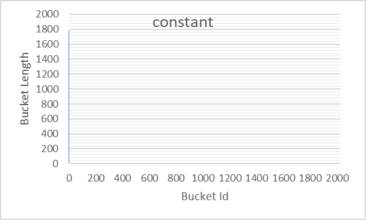
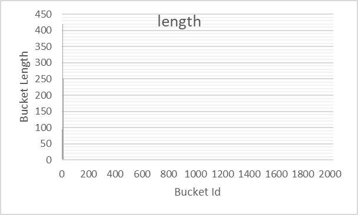
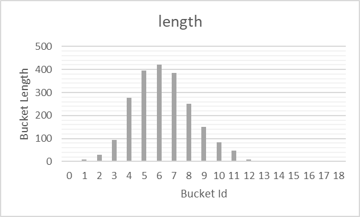
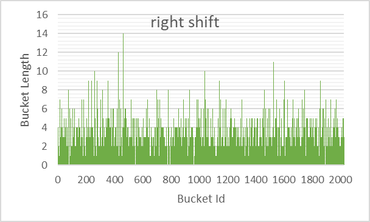

# Отчёт об исследовании хеш-таблиц

## Введение
Рассмотрим следующую задачу:

*"Дан художественный текст на английском языке. Требуется составить множество слов текста, то есть структуру, хранящую все его слова и позволяющую как можно быстрее определять принадлежность некоторого слова к нему."*

Задача может быть решена с использованием хеш-таблицы c закрытой адресацией (см. описание алгоритма на сайте [AlgoList](https://www.algolist.net/Data_structures/Hash_table)).

Введём следующие определения:
 - **ключ** (**элемент**) - идентификатор элемента, хранящегося в структуре. В случае рассматриваемой задачи это слово из текста.
 - **хеш-функция** - функция, сопоставляющая ключам некоторые натуральные числа. Числа, сопоставляемые одинаковым ключам должны быть равны.
 - **хеш** - значение хеш-функции.
 - **список** (**bucket**) - множество элементов, в которое можно добавлять ключи и проверять, находятся ли они в нём. Соответствует структуре данных "связный список".
 - **хеш-таблица** (**таблица**) - множество списков, в каждом из которых всем ключам соответствуют одинаковые (по модулю количества списков в таблице) хеши.

**Проверка принадлежности** ключей к хеш-таблице происходит по следующему алгоритму:
 1. Пусть требуется проверить ключ $x$ на принадлежность к таблице. Посчитаем хеш элемента $h(x)$, где $h$ - хеш-функция.
 2. Рассмотрим $h(x) \text{mod} N$ - й список таблицы, где $N$ - количество списков в таблице. Если $x$ принадлежит списку, то $x$ принадлежит таблице. Иначе $x$ не принадлежит таблице.

|  |
| --- |
| *Рисунок 1. Иллюстрация к проверке принадлежности ключа к таблице. Зелёными ячейками обозначены индексы списков внутри таблицы. Синими клетками обозначены элементы самих списков. Символом '%' обозначено взятие числа по модулю. Остальные обозначения совпадают с обозначениями, введёнными в описании алгоритма.* |

**Добавление** ключа в таблицу происходит по следующему алгоритму:
 1. Если ключ $x$ уже принадлежит таблице, ничего не делать.
 2. Иначе добавить $x$ в $h(x) \text{mod} N$ - й список таблицы, где $N$ - количество списков в таблице, $h$ - хеш-функция.

|  |
| --- |
| *Рисунок 2. Иллюстрация к добавлению ключа к таблице. Обозначения аналогичны вводимым в рисунке 1.* |

# Часть 1: Исследование распределений хеш-функций в задаче хранения слов художественного текста
Из алгоритма распределения ключей по спискам следует, что распределение зависит от выбора хеш-функции, используемой для расчёта хешей элементов. К примеру, хеш-функция, возвращающая на все ключи число 1 (тождественно равная 1) даст распределение, отличное от того, что даёт хеш-функция, тождественно равная числу 2.

Целью данной части работы было исследование распределений, даваемые различными хеш-функциям на массиве ключей, взятых из литературного текста.

Исследуемые хеш-функции:
 1. `constant_hash`: сопоставляет любому ключу хеш 1, $h(x)=1$,
 2. `first_char_hash`: сопоставляет каждому ключу хеш его первого байта, $h(x)=x_0$,
 3. `length_hash`: сопоставляет каждому ключу его длину как нуль-терминированного слова, $h(x)=\text{len}(x)$,
 4. `sum_hash`: сопоставляет каждому ключу сумму значений его байт, $h(x)=\sum_{i}x_i$,
 5. `left_shift_hash`: сопоставляет каждому ключу такой последовательный XOR его байт, что после каждой операции побитового исключения выполняется циклический сдвиг хеша на 1 бит влево,
  
  $$\text{len}(x)=0 \Rightarrow h(x)=0$$
  
  $$\text{len}(x)>0 \Rightarrow h(x)=\text{rol}(h(x_{[0, \dots ,\text{len}(x)-1)}))\otimes x_{\text{len}(x)-1}$$
 6. `right_shift_hash`: аналогично `left_shift_hash`, но сдвиг происходит вправо,
 
  $$\text{len}(x)=0 \Rightarrow h(x)=0$$
  
  $$\text{len}(x)>0 \Rightarrow h(x)=\text{ror}(h(x_{[0, .. ,\text{len}(x)-1)}))\otimes x_{\text{len}(x)-1}$$
 7. `murmur_hash`: функция хеширования MurmurHash64

Использованные обозначения:
 - $h$ - хеш-функция,
 - $x$ - ключ (строка символов $x_1,x_2,\dots,x_{\text{len}(x)-1}$),
 - $x_i$ - $i$-й символ строки $x$ (в нумерации с 0)
 - $\text{len}(x)$ - длина строки $x$,
 - $x_{[0, \dots ,\text{len}(x)-1)}$ - строка $x$ кроме последнего символа,
 - $\text{rol}(t)$ - циклический побитовый сдвиг числа $t$ влево,
 - $\text{ror}(t)$ - циклический побитовый сдвиг числа $t$ вправо,
 - $\otimes$ - операция побитового исключающего "или".

Реализации хеш-функций приведены в файле [src/hash/hash_functions.cpp](src/hash/hash_functions.cpp) на странице `Processing`.

## Методы
Была составлена программа, реализующая хеш-таблицу на 2027 списков. Данной программе на вход передавался массив слов произведения Вильяма Шекспира ["The Comedy of Errors"](./assets/comedy_of_errors.txt) в кодировке utf-8 (без учёта регистра). Массив слов мог включать повторы, которые отбрасывались на этапе вставки слов в таблицу. В тексте было 1784 уникальных слова.

После распределения слов по спискам хеш-таблицы в соответствии с хешами, выданными тестируемой хеш-функцией, программа измеряла длины получившихся списков и записывала измерения в файл в виде таблицы в формате `csv`.

## Результаты
Результаты измерений представлены на рисунках 3 - 8.

|   |
| --- |
| *Рисунок 1. Гистограмма распределения, даваемого `const_hash`. Слева - полное распределение, справа - его увеличенный фрагмент.* |

|   |
| --- |
| *Рисунок 2. Гистограмма распределения, даваемого `first_char_hash`. Слева - полное распределение, справа - его увеличенный фрагмент.* |

|   |
| --- |
| *Рисунок 3. Гистограмма распределения, даваемого `length_hash`. Слева - полное распределение, справа - его увеличенный фрагмент.* |

|  |
| --- |
| *Рисунок 4. Гистограмма распределения, даваемого `sum_hash`.* |

|  |
| --- |
| *Рисунок 5. Гистограмма распределения, даваемого `left_shift_hash`.* |

|  |
| --- |
| *Рисунок 6. Гистограмма распределения, даваемого `right_shift_hash`.* |

|  |
| --- |
| *Рисунок 7. Гистограмма распределения, даваемого `murmur_hash`.* |

|   |
| --- |
| *Рисунок 8. Сравнительная гистограмма всех исследованных хеш-функций. Слева - по стандартному отклонению, справа - по максимальной длине списка.* |

## Выводы и обсуждение
Как можно заметить, распределения, даваемые `sum_hash`, `left_shift_hash`, `right_shift_hash` и `murmur_hash` обладают наименьшими максимальными длинами списков и стандартными отклонениями. Среди них функцией, дающей наименьшее по максимальной длине и стандартному отклонению распределение является `murmur_hash`.

`const_hash` по определению определила все ключи в один список, что увеличило оба измеряемых параметра его распределения.

Значение `first_char_hash` не могла превышать 255 по определению, так как все ключи были в кодировке utf-8, и, следовательно, код первой буквы слова не мог превышать 255.

`length_hash` так же по определению не превышала 17, так как длины всех слов в тексте не превышали 17.

`sum_hash` хоть и обладает распределением, гораздо более распространённым по спискам таблицы, чем у ранее рассмотренных функций, но в его распределении визуально становится заметна закономерность, которой не наблюдается у `left_shift_hash`, `right_shift_hash` и `murmur_hash` (череда "пиков", начинающаяся у списка с индексом 100 и заканчивающаяся у списка с индексом 1400). Распределение ограничено списком с индексом 1800.

О распределениях `left_shift_hash`, `right_shift_hash` и `murmur_hash` можно судить по их распределениям. `left_shift_hash` даёт менее равномерное распределение ключей по спискам, чем `right_shift_hash`, который, в свою очередь, даёт распределение менее равномерное, чем у `murmur_hash`.

`murmur_hash` даёт наиболее "равномерное" распределение на данном множестве ключей, что показывает пригодность функции `murmur_hash` к использованию в хеш-таблицах, по тем или иным причинам требующих равномерного распределения ключей в них.

# Часть 2: Исследование оптимизаций поиска значений в хеш-таблице с закрытой адресацией.
Целью данной части работы является измерение коэффициента ускорения при использовании различных методов оптимизации проверки принадлежности элементов к таблице.

Исследуемые оптимизации:
 - оптимизация при помощи SIMD-intrinsics,
 - оптимизация ассемблерными вставками,
 - оптимизация переписыванием части кода на assembly и его линковки к основной программе, написанной на C.

## Методы
В качестве объекта оптимизации была взята программа, выполняющая следующие действия:
 1. заполнить хеш-таблицу на 2027 списков с хеш-функцией [MurmurHash64](https://en.wikipedia.org/wiki/MurmurHash) ключами, являющимися словами произведения Вильяма Шекспира ["The Comedy of Errors"](assets/comedy_of_errors.txt) в нижнем регистре в кодировке utf-8,
 2. 2000 раз выполнить поиск всех слов произведения в таблице (т.е. 2000 раз запустить цикл по всем словам произведения, для каждого из которых выполняется проверка на принадлежность к таблице).
 3. Повторить предыдущее действие 30 раз, записывая время исполнения каждого повтора в таблицу.
 4. Записать таблицу измерений в файл в формате `csv`.

Далее на программе были выполнены исследуемые оптимизации. Перед применением каждой оптимизации программа анализировалась valgrind с модулем callgrind для определения функции программы, оптимизация которой даст наибольший прирост производительности.

Текст подавался программе в виде бинарного файла, разбитого на области по 32 байта, каждая из которых хранила по одному слову текста в кодировке utf-8. Пустые байты были заполнены нулями, слова длинны более 32 игнорировались (в используемом тексте таких слов не было).

Флаги компиляции: `-ggdb3 -std=c++2a -O2 -pie -march=corei7 -mavx2` (из списка были исключены флаги `-I` и `-W`, полный список флагов см. в файле [makefile](makefile)).

Условия запуска:
 - Ноутбук Lenovo Legion 15ARH05H, подключенный к снабжающей его сети электропитания,
```
Processor	AMD Ryzen 5 4600H with Radeon Graphics            3.00 GHz
Installed RAM	16.0 GB (15.9 GB usable)
Product ID	00325-81942-83222-AAOEM
System type	64-bit operating system, x64-based processor
```
 - ОС: Windows 10 Home 22H2 (Build 19045.2846),
 - WSL: Ubuntu 20.04.5 LTS,
 - Температура процессора в момент тестирования не превышала 67 градусов Цельсия.

## Результаты
Результат работы не оптимизированной программы можно найти в файле [results/bmark_0.csv](results/bmark_0.csv).

**Среднее время обработки 2-го шага алгоритма (поиска слов в тексте 2048 раз) базовой версией программы составило $0.71\pm0.01$ секунд.**

Стоит обратить внимание, что так как valgrind значительно замедляет программу, количество повторов поиска было снижено с 2000 до 1 в версиях, предназначенных для профилирования, и сделана соответствующая поправка при выборе следующей оптимизируемой функции. В листингах представлен НЕ модифицированный вывод анотатора вывода профилизатора.

Фрагмент результата профилирования программы на данном этапе приведён в листинге 1.
```log
--------------------------------------------------------------------------------
Ir         
--------------------------------------------------------------------------------
78,398,333  PROGRAM TOTALS

--------------------------------------------------------------------------------
Ir          file:function
--------------------------------------------------------------------------------
12,438,032  /build/glibc-SzIz7B/glibc-2.31/string/../sysdeps/x86_64/multiarch/memset-vec-unaligned-erms.S:__memset_avx2_unaligned_erms [/usr/lib/x86_64-linux-gnu/libc-2.31.so]
 9,931,680  ./src/hash/hash_functions.cpp:murmur_hash(void const*, void const*) [/root/projects/hash_functions/build/hash_testcase_v0.1_dev_linux.out]
 9,064,277  src/hash/hash_table.hpp:HashTable_find_value(HashTable const*, unsigned long long, char const*, int (*)(char const*, char const*)) [/root/projects/hash_functions/build/hash_testcase_v0.1_dev_linux.out]
 5,862,256  /build/glibc-SzIz7B/glibc-2.31/stdio-common/vfprintf-internal.c:__vfprintf_internal [/usr/lib/x86_64-linux-gnu/libc-2.31.so]
 5,525,198  /build/glibc-SzIz7B/glibc-2.31/libio/genops.c:_IO_default_xsputn [/usr/lib/x86_64-linux-gnu/libc-2.31.so]
 4,746,791  /build/glibc-SzIz7B/glibc-2.31/string/../sysdeps/x86_64/multiarch/strcmp-avx2.S:__strcmp_avx2 [/usr/lib/x86_64-linux-gnu/libc-2.31.so]
```
*Листинг 1. Фрагмент вывода valgrind, обработанного callgrind_annotate, полученного при анализе базовой версии программы.*

Как можно заметить, дольше всего программа обрабатывает функции `murmur_hash` и `HashTable_find_value` (функцию поиска ключа в хеш-таблице). `murmur_hash` довольно сложно оптимизировать `SIMD-intrinsic`-ами, так что оптимизируем функцию `HashTable_find_value`, которая тратит незначительно больше ресурсов, чем `murmur_hash`, но при этом поддаётся оптимизации векторными регистрами.

Результат профилирования на данном этапе приведён в листинге 2.
```log
--------------------------------------------------------------------------------
Ir         
--------------------------------------------------------------------------------
59,569,618  PROGRAM TOTALS

--------------------------------------------------------------------------------
Ir         file:function
--------------------------------------------------------------------------------
9,931,680  ./src/hash/hash_functions.cpp:murmur_hash(void const*, void const*) [/root/projects/hash_functions/build/hash_testcase_v0.1_dev_linux.out]
6,162,303  src/hash/hash_table.hpp:HashTable_find_value(HashTable const*, unsigned long long, long long __vector(4), int (*)(long long __vector(4), long long __vector(4))) [/root/projects/hash_functions/build/hash_testcase_v0.1_dev_linux.out]
5,862,240  /build/glibc-SzIz7B/glibc-2.31/stdio-common/vfprintf-internal.c:__vfprintf_internal [/usr/lib/x86_64-linux-gnu/libc-2.31.so]
5,525,198  /build/glibc-SzIz7B/glibc-2.31/libio/genops.c:_IO_default_xsputn [/usr/lib/x86_64-linux-gnu/libc-2.31.so]
```
*Листинг 2. Фрагмент вывода valgrind, обработанного callgrind_annotate, полученного при анализе версии программы, ускоренной SIMD-intrinsic-ами.*

Результат работы программы на данном этапе оптимизации - [results/bmark_1.csv](results/bmark_1.csv).

**Время обработки 2-го шага алгоритма программой, оптимизированной SIMD-intrinsic-ами, составляет $0.50\pm0.01$ секунд.**

**Ускорение относительно предыдущей версии программы составило $1.42\pm0.06$ раза.**

Попытаемся ускорить функцию `murmur_hash`, переписав её с использованием ассемблерных вставок. Стоит заметить, что так как наличие ассемблерных вставок в функции запрещает компилятору применять большинство оптимизаций, имеет смысл лишь переписывание всей функции за исключением разве что заголовка, и то для данной функции он тривиален (т.е. включает только `label` функции без фиксации stack frame-а). За основу переписанной версии можно взять код, сгенерированный компилятором `CLang`, генерирующий для данной функции более эффективный код, чем используемый для компиляции проекта `gcc`. Далее для оптимизации можно убрать из кода несколько проверок, не требующихся в контексте данной задачи (к примеру проверки на длину ключа, так как мы знаем, что это значение - константа).

**С данной оптимизацией среднее среднее время обработки стало $0.50\pm0.02$ секунды. Ускорение относительно предыдущей версии - $1.01\pm0.05$. Ускорение относительно базовой версии - $1.43\pm0.07$.**

Так как относительное ускорение мало и не превосходит погрешности эксперимента, логичном шагом на данной этапе было бы прекращение попыток оптимизации хотя бы данной функции.

*Но мы продолжим "оптимизировать" программу, чтобы показать, что мы умеем линковать C-шные программы с asm-овскими.*

```log
--------------------------------------------------------------------------------
Ir         
--------------------------------------------------------------------------------
59,538,352  PROGRAM TOTALS

--------------------------------------------------------------------------------
Ir         file:function
--------------------------------------------------------------------------------
9,931,680  ./src/hash/hash_functions.cpp:murmur_hash(void const*, void const*) [/root/projects/hash_functions/build/hash_testcase_v0.1_dev_linux.out]
6,162,303  src/hash/hash_table.hpp:HashTable_find_value(HashTable const*, unsigned long long, long long __vector(4), int (*)(long long __vector(4), long long __vector(4))) [/root/projects/hash_functions/build/hash_testcase_v0.1_dev_linux.out]
5,862,240  /build/glibc-SzIz7B/glibc-2.31/stdio-common/vfprintf-internal.c:__vfprintf_internal [/usr/lib/x86_64-linux-gnu/libc-2.31.so]
```
*Листинг 3. Фрагмент вывода valgrind, обработанного callgrind_annotate, полученного при анализе версии программы, ускоренной SIMD-intrinsic-ами и ассемблерными вставками.*

Выделим переписанную на asm функцию `murmur_hash` в отдельный файл и прилинкуем его к проекту, надеясь на улучшение.

**Среднее время обработки с описанной "оптимизацией" составило $0.50\pm0.01$ секунды. Ускорение относительно предыдущей версии - $1.01\pm0.05$ раза. Ускорение относительно базовой версии - $1.44\pm0.06$.**

Обработка исходных результатов экспериментов была проведена в файле [results/bmark_combined.xlsx](results/bmark_combined.xlsx) на странице `Processing`.

## Обсуждение и выводы
Как было показано, наиболее эффективной оптимизацией была оптимизация SIMD-intrinsic-ами. Обе оптимизации ассемблером дали незначительное ускорение.

Результаты показывают, что современные компиляторы хорошо оптимизируют код, написанный на языке программирования C, в связи с чем имеют смысл лишь оптимизации с изменением логики работы программы. К примеру, первая из приведённых оптимизаций дала наилучший результат, так как предполагала изменение логики работы программы под использование векторных регистров, которое было возможно только с дополнительными предположениями о данных, обрабатываемых программой. Очевидно, компилятор не может выполнить данные оптимизации, так как не обладает необходимой информацией.
